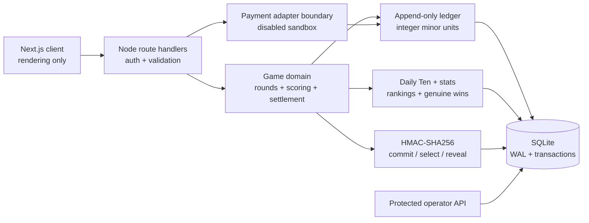

# SpinWord

SpinWord is a server-authoritative social word-game sandbox with unlimited independent rounds, Standard and Max modes, free Loot Coins, purchased-but-nonredeemable Spin Coins, verifiable word selection, Daily Ten progress, private recent-game history, genuine-win leaderboards, and operator risk foundations.

Loot Coins and Spin Coins are virtual credits. They cannot be transferred, withdrawn, redeemed, converted into each other, or exchanged for cash or cryptocurrency. Crypto purchasing ships disabled and requires an approved provider integration.

## What changed from the prototype

The original repository was a single client-side React component. It shipped its answer list to the browser, chose the daily answer in client code, stored balances and results in `localStorage`, calculated rewards on the client, displayed seeded fake winners, and had no API, authentication boundary, ledger, database, tests, or versioned configuration.

This upgrade preserves the dark neon SpinWord identity and responsive keyboard/board, while moving authority to Node route handlers and SQLite:

- strict TypeScript throughout;
- separate server balances and append-only ledger categories for `LOOT_COIN` and `SPIN_COIN`;
- idempotent daily 1,000,000 Loot Coin claim at the UTC date boundary;
- server-locked mode, currency, amount, paytable version, pool version, nonce, answer, and commitment;
- Standard `7x / 5x / 3x / 1.7x / 0.7x / 0.3x` and Max `100x / 5x / 3x / 1.5x / 0.7x / 0.33x` total-return paytables;
- HMAC-SHA256 selection with rejection sampling and post-settlement seed reveal;
- idempotent settlement and exact integer-minor-unit return calculations;
- Daily Ten first-ten scoring with continued play after ten;
- authenticated-player history boundaries, masked genuine-win feed, and deterministic rankings;
- sandbox Spin Coin packages and signed webhook foundation with a hard $10 minimum;
- feature flags, risk limits, responsible-play fields, analytics events, fraud flags, audit logs, tournaments, missions, achievements, promotions, referrals, affiliates, notifications, and operator tables;
- automated unit/integration tests, a two-strategy RTP simulator, word-pool validator, CI, and health endpoint.

## Architecture



Sensitive answers, server seeds, balances, debits, returns, risk checks, and settlement logic remain server-only. The active development answer pool is intentionally small and clearly labeled; it is not a production pool and produces no approved RTP claim.

## Quick start

Requirements: Node.js 20.9 or later.

```bash
npm install
cp .env.example .env.local
npm run db:migrate
npm run dev
```

Open `http://localhost:3000`. Sandbox authentication automatically creates one local player unless `SPINWORD_SANDBOX_AUTH=false`.

## Commands

```bash
npm run dev                       # local development
npm run lint                      # Next/ESLint checks
npm run typecheck                 # strict TypeScript
npm test                          # unit + integration tests
npm run test:integration          # financial/game integration tests
npx playwright install chromium  # one-time E2E browser install
npm run test:e2e                  # desktop + mobile Playwright flows
npm run simulate                  # default 1,000,000-round development simulation
npm run simulate -- --rounds=5000000 --strategy=ordered
npm run words:validate -- ./pool.json
npm run db:migrate
npm run db:reset-sandbox -- --confirm  # nonproduction generated player data only
npm run build
npm start
```

Simulation JSON and CSV reports are written under `reports/`. They are labeled development results and must not be used as product RTP claims.

## API surface

| Method | Route | Purpose |
|---|---|---|
| `GET` | `/api/session` | Player, balances, limits, preferences, active round |
| `POST` | `/api/claim/daily-loot` | Idempotent daily Loot Coin grant |
| `POST` | `/api/rounds` | Validate, debit, commit, and create a round |
| `GET` | `/api/rounds` | Private recent games with filters/pagination |
| `GET` | `/api/rounds/:id` | Private round review |
| `POST` | `/api/rounds/:id/guesses` | Validate and score a guess server-side |
| `POST` | `/api/rounds/:id/settle` | Idempotent settled-round retrieval |
| `GET` | `/api/fairness/:roundId` | Post-settlement recomputation data |
| `GET` | `/api/player/daily-progress` | First-ten Daily Ten progress |
| `GET` | `/api/player/statistics` | Overall and mode/currency statistics |
| `GET` | `/api/leaderboards` | Period/mode/currency genuine rankings |
| `GET` | `/api/public/recent-wins` | Opted-in, masked, moderated settled wins |
| `GET` | `/api/payments/packages` | Protected package configuration |
| `POST` | `/api/payments/quotes` | Disabled sandbox quote adapter |
| `POST` | `/api/payments/webhook` | Signed, idempotent confirmed-payment credit |
| `GET` | `/api/operator/overview` | Protected virtual-credit exposure/liability view |
| `GET` | `/api/health` | Process and database health |

## Database and migrations

`db/migrations/001_initial.sql` is append-only and creates the full launch foundation: players, separate currency accounts, ledger entries, rounds, guesses, versioned paytables and pools, Daily Ten, challenges, statistics, achievements, leaderboards, tournaments, missions, promotions, referrals, affiliates, packages/quotes, notifications, public wins, fraud/risk, audit, and analytics tables with recent-game, settlement, leaderboard, public-win, tournament, and affiliate indexes.

Financial amounts use integer minor units (`100 = 1.00`) and database transactions. SQLite WAL plus process-local transactional serialization is appropriate for the bundled single-instance sandbox. A horizontally scaled production service must migrate the schema to PostgreSQL and use row-level locks/serializable transactions.

## Word-pool import and publication

1. Prepare a reviewed JSON array containing exactly 2,048 unique uppercase five-letter answers with no fabricated filler.
2. Validate it: `npm run words:validate -- ./pool.json`.
3. Import words into a new `word_pool_versions` draft through a protected operations job.
4. Run both solvers at 1,000,000+ rounds, then at the intended higher-volume count.
5. Review answer familiarity, difficulty mix, solver behavior, variance, maximum exposure, and accepted-guess coverage.
6. Save signed JSON/CSV simulation reports and solver version.
7. Publish the immutable pool in a transaction and update the configured active version. Never edit a published version.

The repository deliberately seeds only a 32-word `DEVELOPMENT` pool. Production publication automation and a licensed source dictionary require operator-supplied reviewed data.

## Environments and deployment

- Local: SQLite file, sandbox player, purchases off.
- Test: isolated in-memory databases, deterministic fixtures, purchases off except direct adapter tests.
- Staging: durable encrypted volume or PostgreSQL migration, real authentication, sandbox payment provider, nonproduction provider credentials.
- Production: PostgreSQL, reviewed identity provider, secrets manager, TLS, backups, monitoring, approved payment configuration, fraud/risk operations, and legal review.

Staging checklist:

1. Set every variable in `.env.example`; use 32+ random bytes for both secrets.
2. Set `SPINWORD_SANDBOX_AUTH=false` after integrating the authentication adapter.
3. Mount a durable database path or complete the PostgreSQL migration.
4. Run `npm ci`, migrations, tests, lint, typecheck, and build.
5. Verify health, backups, restore, structured log ingestion, settlement retry alerts, and rollback artifact.
6. Keep crypto purchases disabled until signed webhooks, asset flags, quotes, confirmations, under/overpayment operations, and reconciliation are reviewed end to end.

Production checklist adds age/region/legal review, account recovery, email delivery, rate limiting at the edge, device-risk integration, payment-provider approval, data retention, key rotation, database PITR, disaster recovery, incident response, accessibility review, load testing, dependency/secret scanning, and independent fairness/security review.

Rollback: retain the previous immutable application artifact and migration backup; stop new round creation, allow/resolve open settlements, restore the prior application, and only restore database state through an audited forward-fix or tested backup procedure. Never delete ledger records.

## Environment variables

Every variable is documented inline in `.env.example`. Important gates:

- `SPINWORD_DB_PATH`: durable SQLite file for the sandbox.
- `SPINWORD_SESSION_SECRET`: session signing material; required in production.
- `SPINWORD_SEED_ENCRYPTION_KEY`: AES-GCM seed encryption material; required in production.
- `SPINWORD_SANDBOX_AUTH`: local auto-player only; disable when real auth is wired.
- `CRYPTO_PURCHASES_ENABLED` and `SANDBOX_PAYMENTS_ENABLED`: both must be true, plus feature flags and credentials, before quotes can open.
- `PAYMENT_WEBHOOK_SECRET`: signs provider callbacks.
- risk/play variables: protected launch ceilings; server configuration can lower the global $100,000 capability.

## Security assumptions and limitations

- The app never treats a browser wallet address as authentication and no longer connects Phantom.
- The local sandbox session adapter is not production authentication. Production must supply reviewed email/session identity, suspension, recovery, and optional nonce/signature wallet linking.
- Route-level distributed rate limiting, device fingerprinting, email delivery, provider blockchain tracking, PostgreSQL row locking, scheduled leaderboard rebuild workers, and a protected visual admin console require external infrastructure and credentials and remain integration seams.
- The payment adapter does not custody keys, purchases are off by default, and no redemption path exists.
- The bundled development word pool is not publishable. No RTP or house-edge claim is made.
- Responsible-play columns and server enforcement for status, cooling-off, daily play volume, and daily purchases are present; production needs reviewed player-facing workflows and jurisdiction-specific policy.
- This is a technical foundation, not a licensing, legal-compliance, fairness-certification, or profitability claim.

## Verification status

See the repository handoff for the exact test/build results generated in the current environment. CI repeats lint, strict type checking, tests, and the production build on Node 22.
